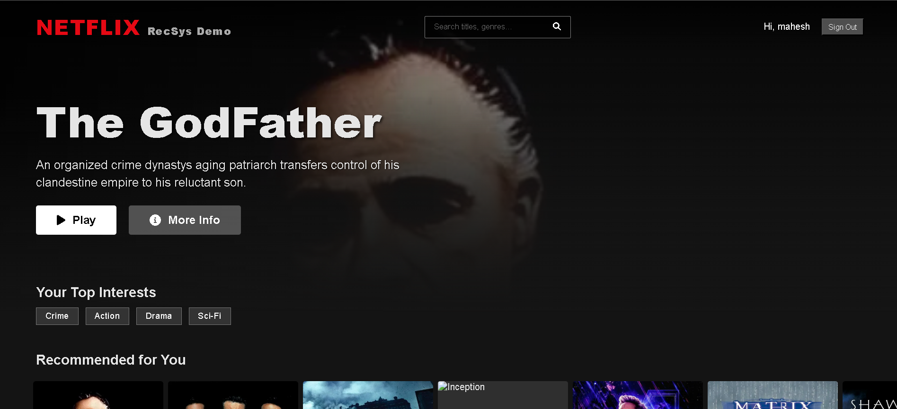
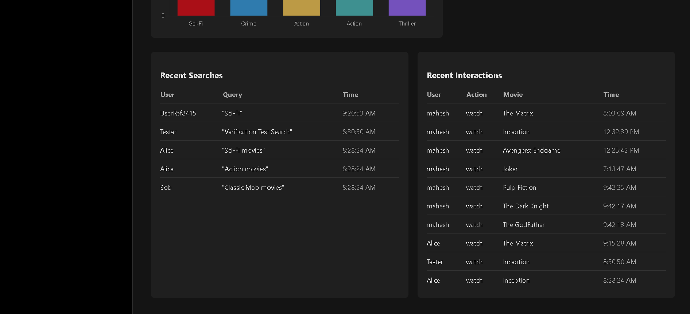
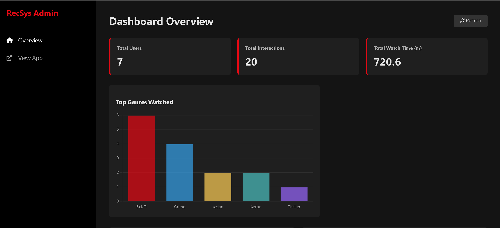
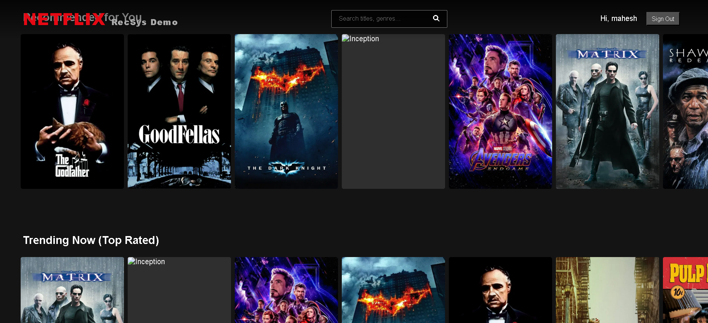

# 🎯 Recommendation System – Real Platform Implementation

A **production-style Recommendation System** built as a **web application** that personalizes content for users based on their interaction behavior.  
This project demonstrates how real-world platforms like **Netflix, Amazon, and OTT services** recommend relevant content to improve user engagement and retention.

✔ Not a notebook  
✔ Not a Google Colab demo  
✔ A real backend + frontend platform  

---

## 🚀 Project Overview

In today’s digital platforms, users face **information overload**, making it difficult to discover relevant content.  
This Recommendation System solves that problem by analyzing **user behavior** and suggesting items that match user preferences.

The project is implemented as a **real, end-to-end web application** with a backend, APIs, and user interface.

---

## 🎯 Objectives

- Personalize user experience  
- Increase user engagement and session duration  
- Improve content and product discovery  
- Enhance customer retention and conversion rates  

---

## ❗ Problem Statement

- Large content catalogs overwhelm users  
- Generic recommendations reduce engagement  
- Lack of personalization impacts business growth  

---

## ⚙️ How the System Works

1. Each user is represented using a **User ID**  
2. Past user interactions are analyzed  
3. Similar users are identified using collaborative filtering  
4. Hidden user preferences are learned using SVD  
5. Personalized recommendations are generated  
6. Real item names (movies/products) are displayed in the UI  

---

## 🧠 Recommendation Models & Algorithms Used

### ✅ Collaborative Filtering
- Recommends items based on **similar users’ behavior**
- Does not require item features

### ✅ Matrix Factorization (SVD)
- Learns hidden user preferences (latent factors)
- Handles sparse user–item data efficiently
- Predicts ratings for unseen items

### ✅ Popularity-Based Model
- Handles **cold-start users**
- Recommends popular or trending items

---

## 🛠️ Tech Stack

### Backend
- Python  
- Flask  
- Collaborative Filtering (SVD)  

### Frontend
- HTML  
- CSS  

### APIs
- REST APIs for recommendation services  

### Data
- User–item interaction dataset  
- Item metadata with real names  

---

## 📊 Key Features

- Personalized recommendations  
- Cold-start user handling  
- REST API-based architecture  
- Web-based dashboard  
- Scalable and modular design  

---

## 🔁 System Architecture
## 🖼️ Screenshots

### 🔹 Dashboard Overview
Main dashboard showing system metrics and overview.

---

### 🔹 Frontend User Interface
User-facing screen where User ID is entered to get personalized recommendations.

---

### 🔹 Backend & API Dashboard
Backend service and API layer of the recommendation system.

---

### 🔹 User Interaction & Recommendations
Personalized recommendations generated based on user behavior.

## 🎥 Demo Flow

1. Open the application in the browser  
2. Enter a User ID in the input field  
3. The system analyzes user behavior  
4. Personalized recommendations are displayed in real time
